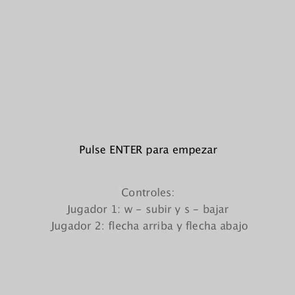

# Pong game

### Autor: Jonay Suárez Ramírez

La aplicación realizada es una versión del juego clásico Pong.

Decidí añadir unas pequeñas instrucciones iniciales y botón para comenzar debido a que al iniciar directamente podría ser confuso la primera vez y tomar por sorpresa al jugador 1.

Para mejorar un poco la experiencia de juego opté por establecer tres sonidos distintos, uno para cuando la pelota rebota con las paredes superior e inferior, otro para cuando la pelota rebota en las barras de los jugadores y el tercero para cuando un jugador anota un punto.

Por lo demás el diseño es bastante estándar.

## Herramientas

Gif hecho con Gyazo.

Sonidos obtenidos en https://freewavesamples.com/

## Resultado

